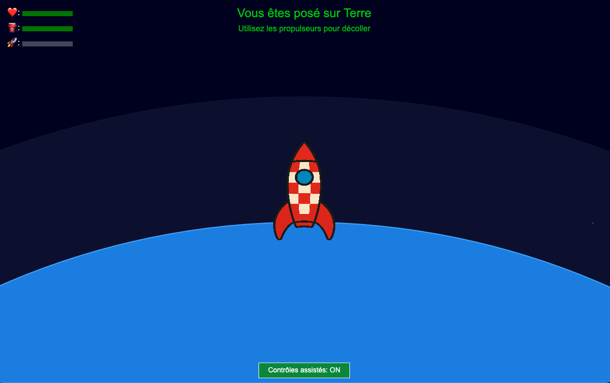
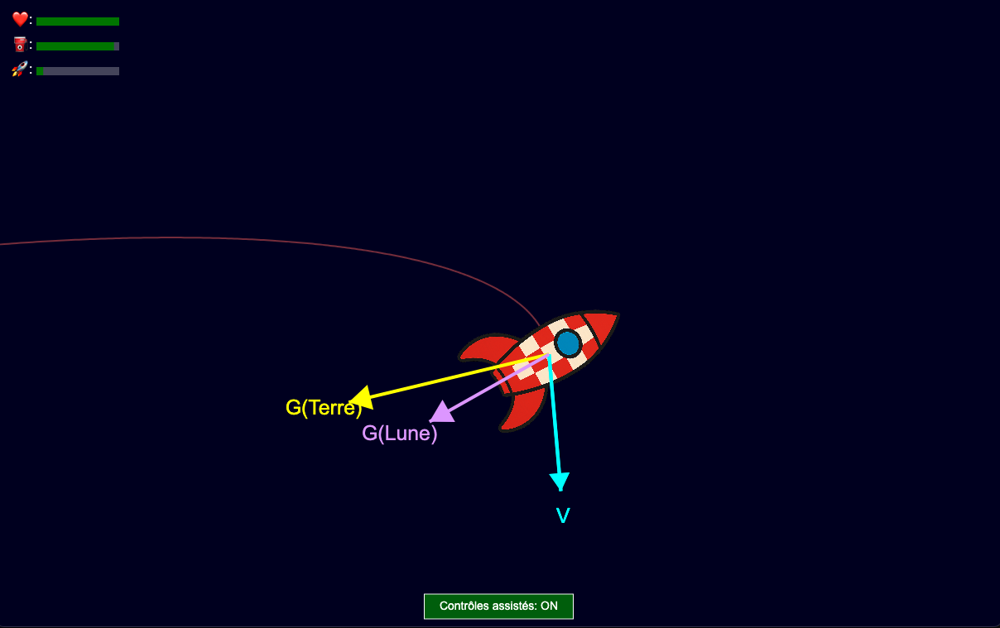
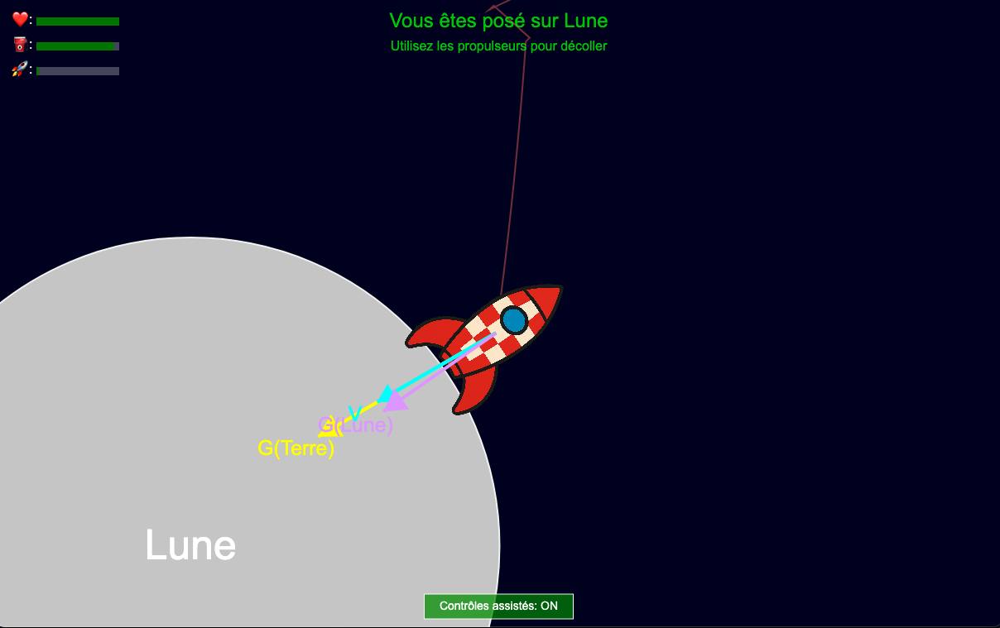
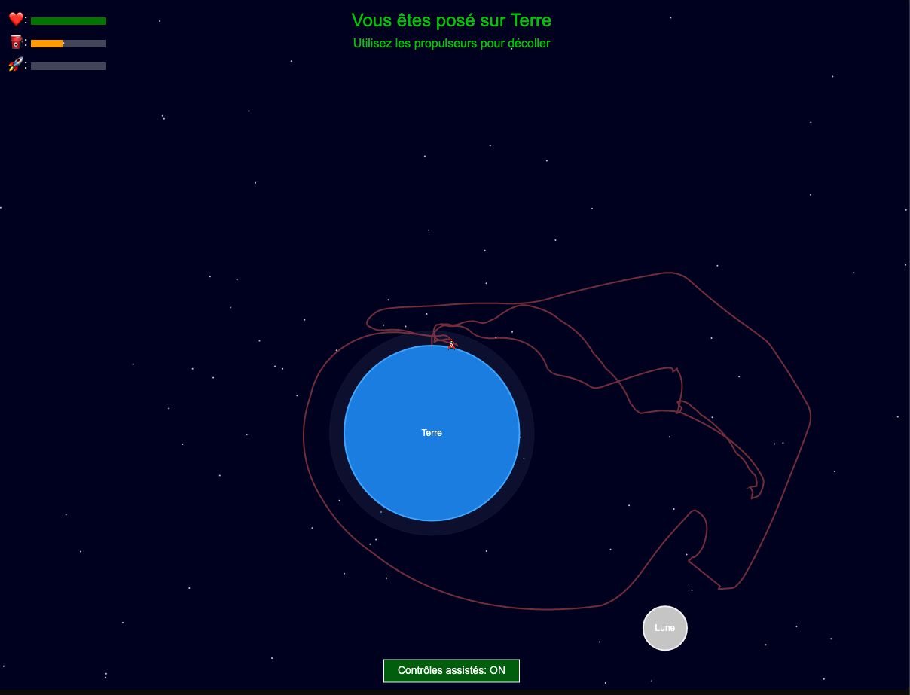

# Simulation de Fusée 🚀

Une simulation interactive et amusante d'une fusée utilisant le moteur physique Matter.js. 🌌

## 🚀 Présentation

Plongez dans l'espace ! Ce projet vous permet de piloter une fusée, d'expérimenter avec les forces de gravité et de tenter des atterrissages (plus ou moins) en douceur sur des corps célestes. 🌍🌕

- [Lancer la Simulation](https://habib256.github.io/gistphysis/rocket/index.html)
  _(Cliquez pour essayer !)_ ✨

### Captures d'écran 📸

*Écran de démarrage de la simulation*

*Visualisation des forces en action* 🧐

*La fusée près de la lune en orbite*

*Suivi de la trajectoire* ዱካ

## ✨ Fonctionnalités Principales

*   **Physique Amusante 😂:** Basée sur Matter.js avec gestion de la gravité.
*   **Pilotage Intuitif 👍:** Contrôlez votre fusée avec les propulseurs.
*   **Exploration Spatiale 🪐:** Naviguez autour d'une planète et de sa lune.
*   **Atterrissages Délicats 😬:** Tentez de vous poser sans tout casser !
*   **Effets Visuels ✨:** Particules pour les propulseurs, collisions, et étoiles scintillantes.
*   **Infos en Direct 📊:** Suivez la vitesse, l'altitude, le carburant, etc.
*   **Trajectoire Visible 📈:** Activez la trace pour voir où vous êtes allé.
*   **Caméra Dynamique 🎥:** Suivi de la fusée et zoom.
*   **Santé et Carburant ❤️‍🩹⛽:** Gérez vos ressources et évitez les crashs 💥.
*   **Aide au Pilotage 🤓:** Activez les contrôles assistés pour une conduite plus stable.
*   **Sons Immersifs 🔊:** Pour les propulseurs et les impacts.
*   **(Debug) Visualisation des Forces 🔬:** Activez l'affichage des vecteurs pour comprendre la physique.

## 🎮 Contrôles

- **↑ ou W** : Propulsion avant
- **↓ ou S** : Propulsion arrière
- **← ou A** : Rotation gauche
- **→ ou D** : Rotation droite
- **R** : Réinitialiser la fusée 🔄
- **C** : Centrer la caméra 🎯
- **+ / -** (ou Molette Souris) : Zoom 🔍
- **T** : Afficher/masquer la trace
- **V** : Afficher/masquer les vecteurs de force (pour debug)

## 🔧 Technologies

- **Matter.js** (+ Plugin Attractors)
- **HTML5 Canvas**
- **JavaScript**

_(Le code est structuré de manière modulaire pour faciliter la compréhension et les modifications 😉)._

## 🚀 Installation

1.  Clonez ce dépôt. 📥
2.  Ouvrez le fichier `index.html` dans votre navigateur. 🎉

## 📝 Personnalisation

Envie d'expérimenter ? 🧪 Le fichier `constants.js` regorge de paramètres à modifier :

- Gravité (`PHYSICS.G`)
- Puissance des propulseurs (`ROCKET.MAIN_THRUST`, `PHYSICS.THRUST_MULTIPLIER`)
- Caractéristiques de la fusée (masse, carburant, etc.)
- Seuils d'atterrissage et de crash (`PHYSICS.LANDING_MAX_SPEED`, `PHYSICS.CRASH_ANGLE_DEG`, etc.)
- ...et bien plus ! 🛠️

## 📈 Perspectives futures

- Missions et objectifs 🏆
- Plus de planètes et de lunes 🔭
- Améliorations visuelles et sonores 🎨🎶
- ... à vous de jouer ? 🤔

## 📜 Licence

Ce projet est sous licence MIT. 👍 